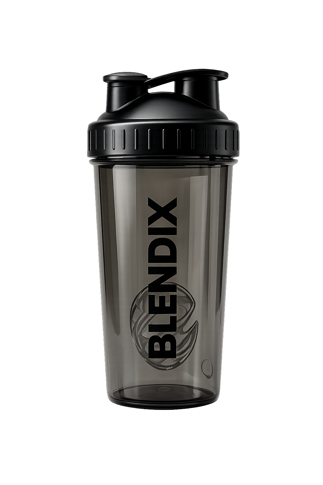
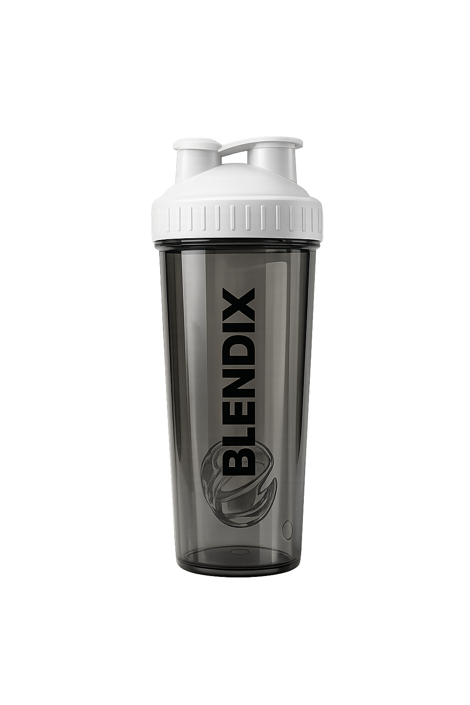
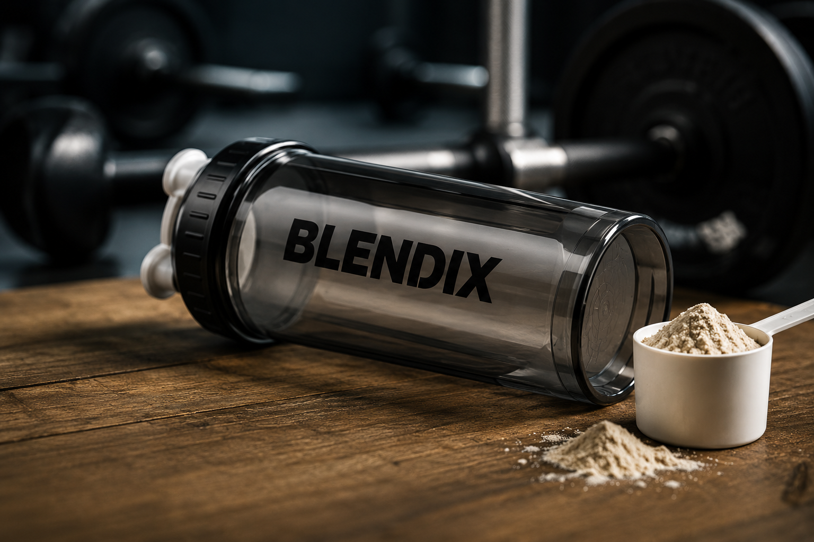

<!DOCTYPE html>
<html lang="de">
<head>
  <meta charset="UTF-8" />
  <meta name="viewport" content="width=device-width, initial-scale=1.0" />
  <title>BLENDIX – Produktwebsite</title>

  
</head>

<body>

  <header class="container">
    
BLENDIX

    <nav>
      <a href="#produkte">Produkte</a>
      <a href="#ueber">Über uns</a>
      <a href="#vorteile">Vorteile</a>
      <a href="#kontakt">Kontakt</a>
    </nav>

    <a class="order" href="#produkte">🛒 Jetzt bestellen</a>
  </header>

  <main>

    

      
    

    <section id="produkte" class="container">

      <h1 class="title">UNSERE PRODUKTE</h1>

      

      

        Hochwertige Shaker für deinen aktiven Lifestyle.
      

      

        

          

            
          

          

            <h3>BLENDIX SHAKER 250ML</h3>

            <ul class="checks">
              <li>BPA-FREI</li>
              <li>Leicht & kompakt</li>
              <li>Auslaufsicher</li>
              <li>Perfekt für unterwegs</li>
            </ul>

            

              1999
            

            <button class="buy">
              Jetzt kaufen
            </button>
          

        

        

          

            
          

          

            <h3>BLENDIX SHAKER 500ML</h3>

            <ul class="checks">
              <li>BPA-FREI</li>
              <li>Spülmaschinenfest</li>
              <li>Auslaufsicher</li>
              <li>Extra Volumen</li>
            </ul>

            

              2999
            

            <button class="buy">
              Jetzt kaufen
            </button>
          

        

      

      

        

          
♧

          <h4>BPA-FREI</h4>
          
Gesundheit steht bei uns an erster Stelle.

        

        

          
▣

          <h4>SPÜLMASCHINENFEST</h4>
          
Einfach reinigen und mehr Zeit für dich.

        

        

          
♢

          <h4>AUSLAUFSICHER</h4>
          
Kein Auslaufen, 100% sicher.

        

        

          
♤

          <h4>HOCHWERTIG</h4>
          
Robustes Material für den Alltag.

        

      

    </section>

    <section id="ueber" class="container about">

      

        
      

      

        <h2>ÜBER BLENDIX</h2>

        

        

          BLENDIX steht für Qualität, Funktionalität und modernes Design.
          Unsere Shaker sind die perfekten Begleiter für Sport,
          Arbeit und Alltag. Mix deinen Erfolg – jeden Tag!
        

        

          

            🏋️
            Für Sport & Fitness
          

          

            💼
            Für Arbeit & Alltag
          

          

            ♡
            Für deinen Lifestyle
          

        

      

    </section>

  </main>

  <footer id="kontakt">

    

      

        
BLENDIX

        

          MIX DEINEN ERFOLG
        

      

      

        <h4>NAVIGATION</h4>

        <a href="#produkte">Produkte</a>
        <a href="#ueber">Über uns</a>
        <a href="#vorteile">Vorteile</a>
        <a href="#kontakt">Kontakt</a>
      

      

        <h4>KONTAKT</h4>

        
✉ info@shakerblendix.de

        
☎ +49 176 12345678

        
◎ @shakerblendix

        
🌐 www.shakerblendix.de

      

      

        <h4>FOLGE UNS</h4>

        

          ◎ ♪
        

      

    

    

      © 2026 BLENDIX – Alle Rechte vorbehalten.
    

  </footer>

</body>
</html>
